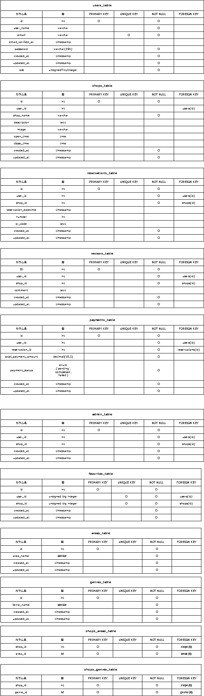
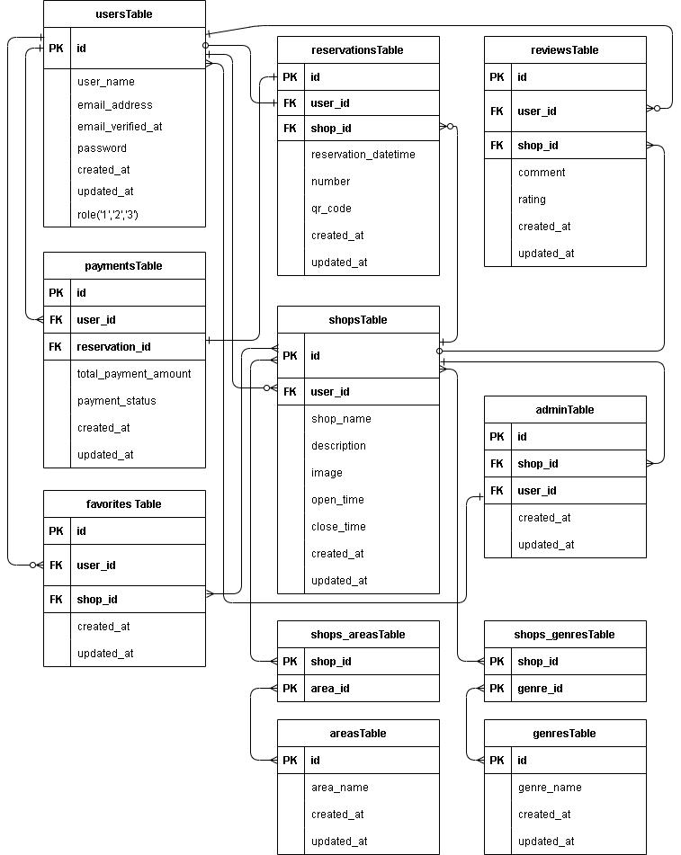

## Rese（リーズ）飲食店予約サービスアプリ

### サービス概要

- 飲食店予約サービスRese（リーズ）は、ある企業のグループ会社向けの飲食店予約サービスです。外部サービスに依存せず、手数料を節約しながら自社で完全にコントロール可能な予約システムを提供します。


## 制作の背景と目的
外部の飲食店予約サービスでは手数料が発生するため、自社で予約サービスを持つことでコスト削減とデータ管理の自由度を高めたいと考えています。

## 制作の目標
- 初年度でのユーザー数10,000人を達成する。
- 直感的で使いやすいインターフェースを提供する。

## 機能要件
- **予約変更機能**: ユーザーはマイページから予約日時や人数を変更できる。
- **評価機能**: 来店後、ユーザーが店舗を5段階で評価し、コメントを残せる。
- **バリデーション**: 認証と予約の際にFormRequestを使用してバリデーションを行う。
- **レスポンシブデザイン**: タブレット・スマートフォン用にブレイクポイント768pxでレスポンシブデザインを実装。
- **管理画面**: 管理者、店舗代表者、利用者の3種類の権限に基づく管理画面を提供。
- **ストレージ**: 店舗の画像をストレージに保存。
- **認証**: メールによる本人確認機能。
- **メール送信**: 管理画面から利用者にお知らせメールを送信。
- **リマインダー**: タスクスケジューラーを利用して、予約当日の朝にリマインダーを送信。
- **QRコード**: 利用者が来店時に提示するQRコードを発行し、店舗側で照合。
- **決済機能**: Stripeを利用した決済機能。

## 作業範囲
- 設計
- コーディング
- テスト

## ターゲットユーザー
- 20〜30代の社会人

## システム要件

- **開発言語**: PHP
- **フレームワーク**: Laravel
- **データベース**: MySQL
- **バージョン管理**: GitHub


## 使用技術

- **フロントエンド**: HTML, CSS, JavaScript
- **バックエンド**: PHP, Laravel
- **データベース**: MySQL
- **バージョン管理**: Git, GitHub


## コントリビューション
このプロジェクトはクローズドソースであり、特定のグループ会社の内部使用に限られています。外部からのコントリビューションは受け付けていません。

## ライセンス
このプロジェクトは特定のクライアントにのみ提供される専用のソフトウェアです。再配布や商用利用は禁止されています。
### 使用技術（実行環境）

- **開発言語**: PHP
- **フレームワーク**: Laravel 8.x
- **データベース**: MySQL
- **バージョン管理**: GitHub
- **コンテナ化技術**: Docker

### テーブル設計・ER図




### 環境構築

- **PHP**: 8.1.29
- **MySQL**: 10.11.6-MariaDB
- **Composer**: 2.7.7
- **Docker**: 26.1.4
- **Laravel Framework**: 8.83.27


- ＊ご使用のPCに合わせて各種必要なファイル(.envやdocker-compose.yml等)は作成、編集してください。

- **1.docker-compose exec bash**
- **2.composer install**
- **3..env.exampleファイルから.envを作成し、環境変数を変更**
- **4.php artisan key:generate**
- **5.php artisan migrate**
- **6.php artisan db:seed**

###クローン作製手順

1. GitHubリポジトリのクローン
```Bash

git clone https://github.com/ponponmama/20240713-erika_hara-rese.git
cd 20240713-erika_hara-rese
```

2. 必要なパッケージのインストール

```Bash　
sudo apt-get update
sudo apt-get install php-curl
```


- PHPを再起動(必要に応じて)

```Bash
docker-compose up　-d --build
```

- php.ini ファイルで curl 拡張機能を有効にする

extension=curl


- curl拡張機能が正しくロードされているか確認

```Bash
php -m | grep curl
```

3. Composerを使用した依存関係のインストール

- Docker環境でPHPコンテナに入り、依存関係をインストールします。

```Bash
docker-compose exec php bash
composer install
```

4. 環境設定ファイルの設定

- .env.example ファイルを .env としてコピーし、必要に応じてデータベースなどの設定を行います。

```Bash
cp .env.example .env
```

5. 環境設定手順

- プロジェクトを始める前に、以下のディレクトリを作成してください。これにより、ファイルの保存場所が正しく設定されます。
- 店舗画像の保存とQRコードを保存するために以下のディレクトリを作成してください。PHPコンテナ内で実行します。

```Bash
mkdir -p /path/to/your/project/storage/app/public/images
mkdir -p /path/to/your/project/storage/app/public/qr_codes
php artisan storage:link
```
#### HTTPS 証明書の発行方法
- QRコードを照合するためにカメラにアクセスしますが、https環境であることが条件です。
HTTPS通信を行うためにはSSL証明書が必要です。以下のコマンドを使用して自己署名のSSL証明書を生成できます。
githubクローンには下記の証明書は入っていない為、作成してください。

```Bash
openssl req -x509 -nodes -days 365 -newkey rsa:2048 -keyout nginx.key -out nginx.crt
```

このコマンド実行時には、以下のような情報を入力します。

- 国名 (2文字コード)
- 州または県名
- 市区町村名
- 組織名
- 組織内部名
- 共通名（サーバのFQDNまたはあなたの名前）
- メールアドレス

例えば、以下のように入力します。

### SSL証明書生成のための情報入力例

- **Country Name (2 letter code)**: `JP` (日本)
- **State or Province Name (full name)**: `Hyogo` (兵庫県)
- **Locality Name (city)**: `Kobe` (神戸市)
- **Organization Name (company)**: `Rese Inc.` (リーズ株式会社)
- **Organizational Unit Name (eg, section) []**:無い場合は空白でもOK
- **Common Name (server FQDN or YOUR name)**: `localhost` (開発環境やテスト環境での一般的な設定)
- **Email Address**: `yourmail@gmail.com` (連絡先メールアドレス)

これらの情報は、SSL証明書を生成する際に必要とされるものです。実際に証明書を生成する際には、適切な値を入力してください。

このコマンドにより、`nginx.key` (秘密鍵) と `nginx.crt` (公開証明書) が生成されます。生成時には上記のようにいくつかの質問に答える必要があります。

#### Docker 環境設定

`docker-compose.yml` ファイルを使用して、Docker環境を構築します。HTTPS用のポート443を開放し、SSL証明書と秘密鍵を適切な場所にマウントします。

#### docker-compose.ymlを編集

ports:
      - "443:443" # HTTPS用のポートを追加
volumes:      
- ./path/to/your/nginx.crt:/path/to/your/nginx.crt # SSL証明書をマウント
- ./path/to/your/nginx.key:/path/to/your/nginx.key # 秘密鍵をマウント

####default.confを編集
listen 443 ssl;
ssl_certificate /path/to/your/ssl/nginx.crt;　 # SSL証明書へのパスを更新
ssl_certificate_key /path/to/your/ssl/nginx.key;::　 # 秘密鍵へのパスを更新


6. アプリケーションキーの生成

```Bash
php artisan key:generate
```

6.データベースのマイグレーション

```Bash
php artisan migrate
```

7.データベースシーダーの実行
- 全てのシーダーを実行する前に、`Areas` テーブルと `Genres` テーブルのシーダーを先に実行する必要があります。これにより、依存関係が正しく処理されます。

```Bash
php artisan db:seed --class=AreasTableSeeder
php artisan db:seed --class=GenresTableSeeder
```

- 上記のシーダーが完了した後、残りのシーダーを実行します。

```Bash
php artisan db:seed
```

8.ローカルサーバーの起動

```Bash
docker-compose up --build
```


####リマインダーメールを送るために必要なCronジョブの設定手順

#####Laravel スケジューラを利用するためには、Cronジョブの設定だけでなく、Laravelのスケジューラを適切に設定する必要があります。以下に、Laravelのスケジューラ設定の完全な手順を示します。

- Laravel スケジューラの設定

Laravelのスケジューラを使用するには、app/Console/Kernel.php ファイル内でスケジュールされたタスクを定義する必要があります。以下は、Kernel.php ファイルにスケジュールを設定する方法の例です。

protected function schedule(Schedule $schedule)
    {
        // ここにスケジュールされたコマンドを追加します。
        $schedule->command('inspire')
                 ->hourly();

        // 予約リマインダーメールを毎日朝7時に送信するスケジュール
        $schedule->command('send:reservation-reminder')
                 ->dailyAt('07:00')
                 ->appendOutputTo(storage_path('logs/reservation_reminder.log'));
    }

この設定では、send:reservation-reminder コマンドが毎日7時に実行され、その実行結果が storage/logs/reservation_reminder.log に記録されます。appendOutputTo メソッドを使用して、コマンドの出力をログファイルに追記するように設定しています。時間は指定したい時刻に変更ください。


### メール設定

プロジェクトでは開発環境でのメール送信のテストに Mailtrap を使用しています。以下の設定を `.env` ファイルに追加してください。これにより、開発中のメール送信を安全にテストすることができます。

- `MAIL_MAILER`: メールドライバー（例: smtp, sendmail）
- `MAIL_HOST`: メールサーバーのホスト名
- `MAIL_PORT`: メールサーバーのポート番号
- `MAIL_USERNAME`: メールサーバーのユーザー名
- `MAIL_PASSWORD`: メールサーバーのパスワード
- `MAIL_ENCRYPTION`: メール送信の暗号化方式（例: tls, ssl）
- `MAIL_FROM_NAME`: メール送信時の差出人名（環境変数 `APP_NAME` を使用する場合もあり）

plaintext

MAIL_MAILER=smtp  
MAIL_HOST=sandbox.smtp.mailtrap.io  
MAIL_PORT=2525  
MAIL_USERNAME=your_mailtrap_username # Mailtrapのユーザー名をここに入力  
MAIL_PASSWORD=your_mailtrap_password # Mailtrapのパスワードをここに入力  
MAIL_ENCRYPTION=tls  
MAIL_FROM_NAME="${APP_NAME}" # アプリケーション名を使用する場合  
MAIL_LOG_CHANNEL=stack  

この設定を適用後、アプリケーションからのメールは Mailtrap の仮想SMTPサーバーを通じて送信され、実際には配信されずに Mailtrap のダッシュボードで確認することができます。

### Stripe 設定

プロジェクトで決済処理を行うために Stripe を使用します。Stripe の API キーを設定することで、安全に決済を処理できます。以下の手順に従って設定を行ってください。

1. Stripe にアクセスし、アカウントを作成またはログインします。
2. ダッシュボードから API キーを取得します。必要なキーは以下の二つです：
   - `STRIPE_KEY`: Stripe の公開可能キー（Public key）
   - `STRIPE_SECRET`: Stripe の秘密キー（Secret key）
3. `.env.example` ファイルを `.env` としてコピーします。
4. コピーした `.env` ファイルを開き、以下の環境変数を更新します：

   ```plaintext
   STRIPE_KEY=ここに公開可能キーを貼り付ける
   STRIPE_SECRET=ここに秘密キーを貼り付ける
   ```

### 注意事項
- **セキュリティのため、Stripe の API キーを公開リポジトリにアップロードしないでください。** これらのキーはあなたのアカウントと直接関連しており、不正利用される可能性があります。
- 環境変数を使用することで、開発環境と本番環境で異なるキーを簡単に切り替えることができます。

この設定により、アプリケーションは Stripe を介して安全に決済処理を行うことができます。


### URL
- **開発環境:** [https://localhost/](https://localhost/)
- **phpMyAdmin:** [http://localhost:8080/](http://localhost:8080/)

